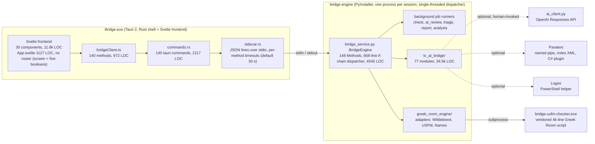
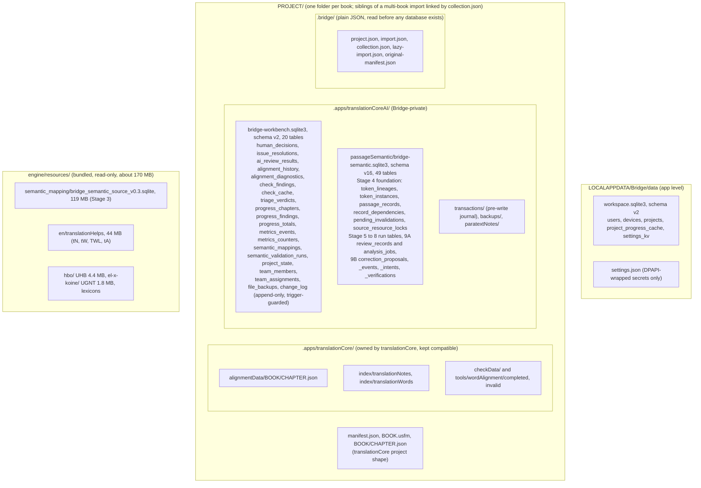
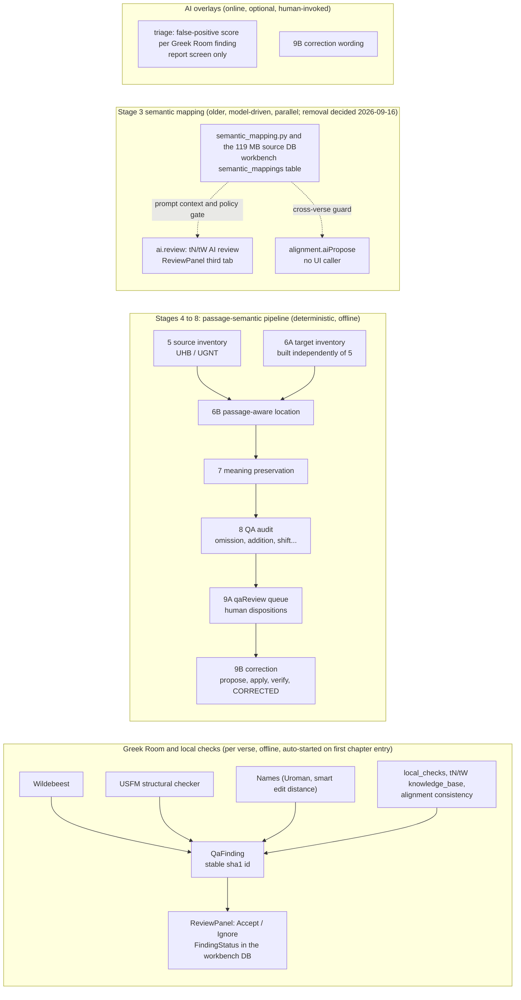
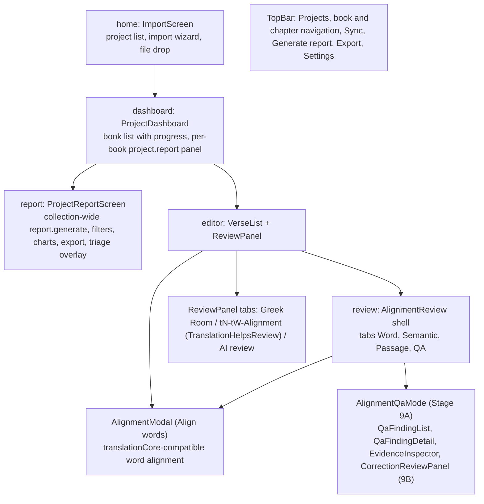

# Bridge — Architecture (current state)

*Rewritten 2026-09-16 against commit `83221fd`, after the workbench database cutover
(#75, #76, #77). Every number and path below was read from the code on that day, not from
older docs. The pre-cutover version of this file, with the original design rationale and
the beta roadmap, is in git history (`git show 83221fd:docs/ARCHITECTURE.md`); the roadmap
now lives only in `DEVELOPER_GUIDE.md`, and the detailed narrative in `BUILD_LOG.md`.*

## 1. Core principle (unchanged since the first design)

> Bridge owns the workflow, UI, project state, human decisions and AI.
> Greek Room is a local, offline QA/NLP engine underneath it.

Three-way division of responsibility, never blurred:

- **Greek Room** says: "This is objectively/statistically suspicious."
- **AI** says: "Here is what it may mean in this passage."
- **Human** says: "This is what the translation should be."

Nothing auto-applies to Scripture. Every finding carries an explicit review status. The one
authorized Scripture writer is Stage 9B's apply step behind a human confirmation. Offline
operation is a product invariant: the only network-shaped code (`ai_client.py`, the Paratext
registry client) is optional and human-invoked, never on the import, open or check path.

## 2. Process boundary and the RPC path

**How a request travels.** A component calls `bridge.someMethod()` in
`src/lib/api/bridgeClient.ts`; that invokes one `#[tauri::command]` in
`src-tauri/src/commands.rs`; the command hands the dotted method name and params to
`sidecar.rs`, which writes one JSON line to the sidecar's stdin and correlates the reply by
`id`; `bridge_service.py`'s `handle_request` matches the name against the `Methods` class
and calls one `BridgeEngine` method. The dispatcher is single-threaded, so a slow handler
delays every other request behind it (`build_project_report`'s docstring records one such
case). Long-running work therefore goes through a background job runner and the UI polls
its status.

**Cost of the shape.** Every RPC is defined four times: engine constant + handler +
dispatcher branch, a Rust command, a TS client method, and TS types (`finding.ts` 884 LOC,
`passageSemanticV1.ts` 860 LOC). Adding a method means four edits and a Rust rebuild. As of
2026-09-16, 50 of the 140 wired methods have no UI caller, 13 more engine methods have no
Rust command at all, and `src-tauri/src/passage_semantic_wire.rs` (1491 LOC of typed
mirrors) is referenced only by `mod` in `main.rs` and its own tests. See
`SIMPLIFICATION_AUDIT_2026-09.md`.

**Per-method timeouts** live in `sidecar.rs` (`request_timeout_seconds`): 30 s default;
`project.import` 300; `project.inspectImport`, `project.list`, `report.get`,
`report.export`, `triage.results`, `correction.applyProposal` 180; `verse.runChecks` 150;
model calls 260 to 300. `project.open` is not in the table.

## 3. Storage

Three independent schema ladders, each with its own version constant and migration blocks
in one module: `passage_semantic_repository.py` (`DATABASE_SCHEMA_VERSION = 16`),
`workbench_repository.py` (`WORKBENCH_SCHEMA_VERSION = 2`), `workspace_repository.py`
(`WORKSPACE_SCHEMA_VERSION = 2`). A bump on one is never a bump on another. The
pre-cutover JSON store directories are listed in `tc_project.py`'s `_PRE_CUTOVER_STORE_DIRS`;
a project carrying any of them refuses to open and is re-imported (no migration, by the
2026-09-14 pre-release decision).

**What opens a project** (`BridgeEngine.open_project`, phase-timed as `[trace] project.open`
on stderr): materialize a lazy import, ensure the original-language packs, construct
`TranslationCoreProject` (which opens and migrates the workbench DB), register the project,
recover incomplete journal transactions, sync the dashboard progress cache, construct
`PassageSemanticRuntime` (opens and migrates the semantic DB, replays pending invalidations,
establishes current text revisions, syncs the source lock and alignment state), then build
the correction services. After #99 (2026-09-16) a first open of Genesis from source measures
about 1 s and a lazy sibling's first open about 4 s; before it, per-verse fsyncs made the
same step take minutes. Any runtime failure degrades the open to `RECOVERY_REQUIRED` rather
than failing it.

## 4. QA pipelines and AI overlays

Two review vocabularies coexist on purpose because they sit on two data sources. The
ReviewPanel writes engine `FindingStatus` values against Greek Room findings; the QA mode of
Alignment Review writes Stage 9A dispositions against `qa_findings` in the semantic DB.
"Accept finding" in the first means the opposite of "Accept translation as correct" in the
second (`VerseList.svelte` documents this). Stage numbering: 6B is location and 7 is meaning;
the test file names are the source of truth.

Each stage's refusals are load-bearing and are stated in its module docstring: Stage 5 never
reads target text; 6A is never seeded from 5; 7 never relocates; 8 never re-runs 6B or
re-judges 7; 9B.4 never re-judges 7 and never sets `CORRECTED` on `PASSED` alone.

## 5. UI surface map

Global chrome: `TopBar.svelte`; modals `SettingsModal` (AI, quality, connections, resources,
security panes), `ExportModal`, `DiagnosticsPanel` (engine log), `LexiconPopup`,
`VerseNotesPopup`, `FindingContextMenu`. State lives in `stores.ts` (chapter/verse-keyed
maps, `verseKey()`), `reviewStores.ts` (Stage 9A queue), `alignmentUi.ts`, `verseEditor.ts`.

**Polling.** App.svelte polls the sidecar for: navigation sync every 800 ms for the app's
lifetime (guarded only by in-flight and engine-ready, not by whether a connection is
enabled), check jobs every 750 ms, QA report jobs every 500 ms, triage every 1000 ms while
running, and cancel-wait every 400 ms.

## 6. Engine subsystems (tc_ai_bridge/)

| Subsystem | Main modules (LOC) |
|---|---|
| Project I/O and import | `tc_project.py` 2980, `project_import.py` 992, `project_registry.py` 531, `usfm.py`, `usfm_passages.py` 308 |
| translationCore compatibility and resources | `resource_materializer.py` 364, `original_language_resources.py` 288, `lexicon_resources.py` 196, `knowledge_base.py` 450, `local_checks.py`, `plugins.py` 251 |
| Word alignment | `alignment_engine.py` 204, `aligned_usfm.py` 166, `word_alignment_evidence.py` 284, `alignment_statistics.py` 372 (backs the consistency finding), `alignment_reliability.py` 428 and `semantic_alignment_guard.py` 124 (AI proposals; removal decided) |
| Stages 4 to 8 | `passage_semantic_repository.py` 5070, `passage_semantic_runtime.py` 1364, `passage_semantic_models.py` 1171, `source_semantic_inventory.py` 779, `target_semantic_inventory.py` 392, `semantic_location.py` 853, `meaning_analysis.py` 560, `qa_audit.py` 822, `analysis_jobs.py` 724 |
| Stage 9A review | `qa_review.py` 412, `review_policy.py`, `qa_target_hash.py` |
| Stage 9B correction | `correction_eligibility.py` 570, `correction_wording.py` 694, `correction_application.py` 306, `correction_application_recovery.py` 232, `correction_affected_analysis.py` 269, `correction_verification.py` 1036 |
| Stage 3 semantic mapping (removal decided) | `semantic_mapping.py` 867, `semantic_mapping_bridge.py` 319, `semantic_mapping_service.py`, `semantic_review_policy.py` 164, `semantic_corpus_discovery.py` 403 (the validation queue on top of it was removed in #100) |
| AI (optional, online) | `ai_client.py` 911, `triage.py` 620, `triage_prompts.py` 220 |
| Connectors | `paratext_connector.py`, `paratext_notes.py` 420, `paratext_api.py`, `logos_connector.py` 281, `navigation.py` 446 |
| Storage and durability | `workbench_repository.py` 1162, `workspace_repository.py` 489, `transaction_journal.py` 177 |
| Reporting | `qa_report.py` 828, `reporting.py` 203, `analytics.py`, `metrics.py` |
| Versification | `versification.py` 333 (imports the vendored Greek Room library directly) |

Greek Room adapters live in `engine/greek_room_engine/adapters/`; the two vendored upstream
trees are `engine/vendor/greekroom-usfm/` (run as a separate executable) and
`engine/vendor/greekroom-versification/` (imported as a library). Each has a `NOTICE.md`.

## 7. Adapter boundary and the QaFinding model

Bridge never imports Greek Room's internal modules directly. Every engine gets a thin
`CheckAdapter` subclass that normalizes native output into `QaFinding[]`
(`engine/greek_room_engine/models/finding.py`, mirrored in `src/lib/types/finding.ts`), fails
soft via `is_available()` when the upstream package is missing, and pins an exact upstream
commit. `WildebeestAdapter` degrades to a mock on Python 3.13 (see CLAUDE.md). Finding ids are
a stable sha1 of chapter, verse, engine, check type and disambiguator, so review decisions
survive re-running checks.

## 8. Explicit non-goals

- No automatic file modification outside Stage 9B's human-confirmed apply.
- No neural retraining; "human approvals become corpus evidence" means local statistics.
- No dependency on an AI API for core QA; Greek Room checks and the Stage 4 to 8 pipeline
  run with zero connectivity.
- No second Scripture writer, no server or login on a translator's runtime path.

## 9. Where the direction is recorded

`DEVELOPER_GUIDE.md` (roadmap, what is actually done), `BUILD_LOG.md` (the session record),
`DECISIONS.md` (dated decisions), `TEAM_ARCHITECTURE.md` (#44 to #47 direction; its §3 and §4
describe what the code does, §5 to §8 are still design), `SIMPLIFICATION_AUDIT_2026-09.md`
(what is slowing the codebase and what to remove).
