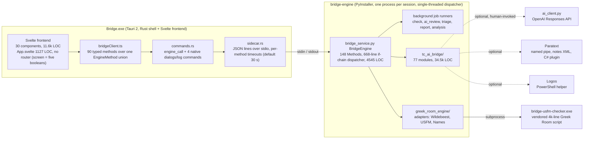
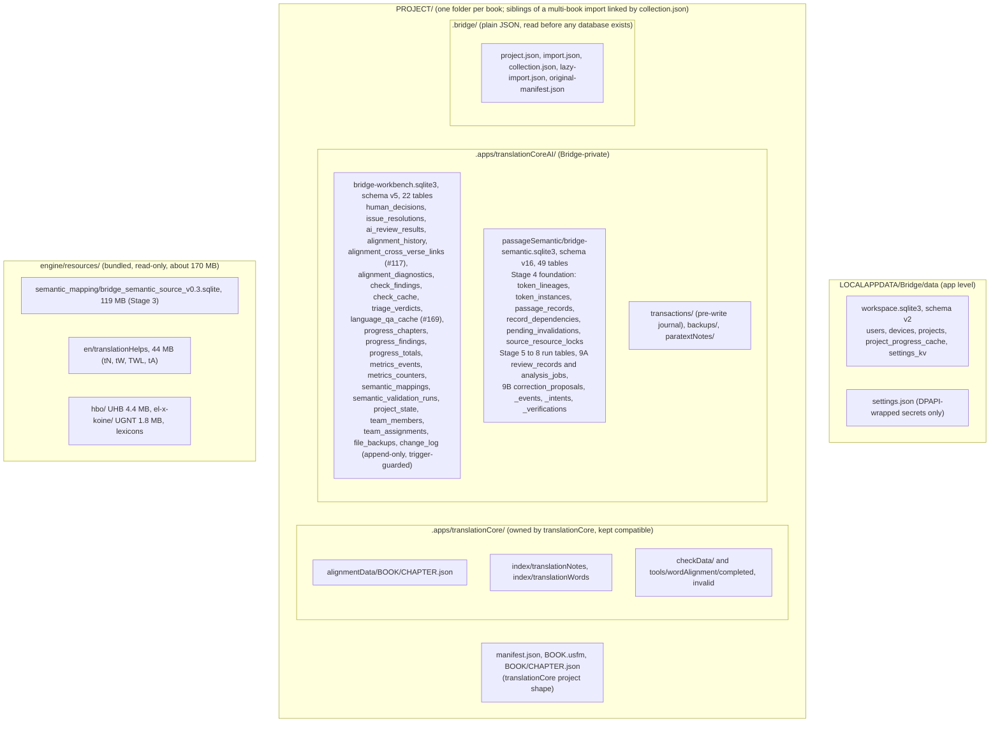
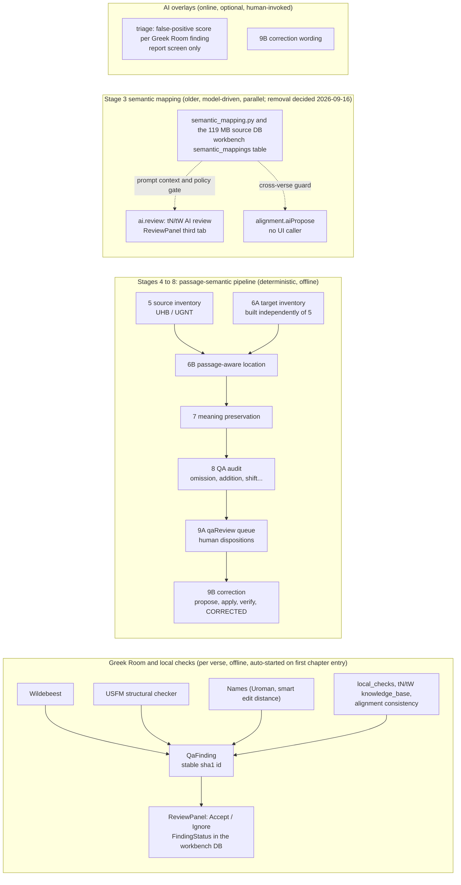

# Bridge — Architecture (current state)

*Rewritten 2026-09-16 against commit `83221fd`, after the workbench database cutover
(#75, #76, #77). Every number and path below was read from the code on that day, not from
older docs. The pre-cutover version of this file, with the original design rationale and
the beta roadmap, is in git history (`git show 83221fd:docs/ARCHITECTURE.md`); the roadmap
now lives only in `DEVELOPER_GUIDE.md`, and the detailed narrative in `BUILD_LOG.md`.*

## 1. Core principle (unchanged since the first design)

> Bridge owns the workflow, UI, project state, human decisions and AI.
> Greek Room is a local, offline QA/NLP engine underneath it.

Three-way division of responsibility, never blurred:

- **Greek Room** says: "This is objectively/statistically suspicious."
- **AI** says: "Here is what it may mean in this passage."
- **Human** says: "This is what the translation should be."

Nothing auto-applies to Scripture. Every finding carries an explicit review status. The one
authorized Scripture writer is Stage 9B's apply step behind a human confirmation. Offline
operation is a product invariant: the only network-shaped code (`ai_client.py`, the Paratext
registry client) is optional and human-invoked, never on the import, open or check path.

## 2. Process boundary and the RPC path

**How a request travels.** A component calls `bridge.someMethod()` in
`src/lib/api/bridgeClient.ts`; that invokes the one generic `engine_call` command in
`src-tauri/src/commands.rs` with the dotted method name (typed as the `EngineMethod`
union) and a params object; the command hands both to
`sidecar.rs`, which writes one JSON line to the sidecar's stdin and correlates the reply by
`id`; `bridge_service.py`'s `handle_request` matches the name against the `Methods` class
and calls one `BridgeEngine` method. The dispatcher is single-threaded, so a slow handler
delays every other request behind it (`build_project_report`'s docstring records one such
case). Long-running work therefore goes through a background job runner and the UI polls
its status.

**Cost of the shape.** An RPC is defined in two places: an engine constant + handler +
dispatcher branch, and a TS client method (plus its TS types in `finding.ts` and friends).
Adding a method is an engine handler, one member of the `EngineMethod` union and one
`bridge.*` wrapper; no Rust changes and no Rust rebuild, because `commands.rs` holds one
generic `engine_call` and four native commands (#115). Before that, the 2026-09-16 audit
found every method defined four times, 50 of 140 with no UI caller, 13 engine methods with
no Rust command, and a 1491-line Rust mirror of the passage-semantic types referenced only
by `mod`; #102, #103 and #105 removed the dead half first, so the union was built from the
live 86 methods. The engine keeps the Stage 4 to 8 handlers as the test harness for those
stages. See `SIMPLIFICATION_AUDIT_2026-09.md`.

**Per-method timeouts** live in `sidecar.rs` (`request_timeout_seconds`): 30 s default;
`project.import` 300; `project.open`, `project.inspectImport`, `project.list`, `report.get`,
`report.export`, `triage.results`, `correction.applyProposal` 180; `verse.runChecks` 150;
model calls 260 to 300. `project.open` joined the 180 class in #112 (step one); step two,
building `PassageSemanticRuntime` lazily, is still open.

### 2.1 Why these choices

*Moved verbatim from `DEVELOPER_GUIDE.md` section 1, 2026-09-17.*

| Layer | Choice | Why |
|---|---|---|
| Desktop shell | **Tauri v2** (Rust) | Native OS webview instead of bundling Chromium → smaller binary, faster cold start, lower idle memory. Matters for an all-day tool on modest field hardware. Rejected **Electron** for this reason. |
| Frontend | **Svelte 4 + TypeScript + Tailwind** | A real web-app UI (colored status badges, inline findings, tabbed panels) that a native widget toolkit fights rather than enables. Also gives a direct path to a future web deployment. Rejected **Python + Tkinter** (the original app's stack) for this reason. |
| Business logic | **Python 3.12/3.13 sidecar** (`bridge-engine`, PyInstaller-bundled) | Reuses the 29 (now 30) existing, proven `tc_ai_bridge` modules from the legacy app rather than rewriting them. |
| Sidecar transport | **JSON-lines over stdin/stdout** | Transport-agnostic protocol defined once in `engine/greek_room_engine/protocol.py`. Desktop uses stdio (`stdio_transport.py` / `src-tauri/src/sidecar.rs`); a future web deployment reuses the same `GreekRoomEngine.handle_request()` behind an HTTP wrapper — no protocol or UI rewrite needed. |

**Trade-off accepted:** Rust has a learning curve for a team with none; in
practice, day-to-day work stays in the Python engine and Svelte frontend —
the Rust shell is intentionally thin (spawn sidecar, route JSON, expose a
few Tauri commands).

**Never integrated directly:** Greek Room's `ephesus/` web API (Docker,
database, its own web UI) — Bridge only uses the underlying check modules,
not the reference web app around them.

## 3. Storage

Three independent schema ladders, each with its own version constant and migration blocks
in one module: `passage_semantic_repository.py` (`DATABASE_SCHEMA_VERSION = 16`),
`workbench_repository.py` (`WORKBENCH_SCHEMA_VERSION = 5`), `workspace_repository.py`
(`WORKSPACE_SCHEMA_VERSION = 2`). A bump on one is never a bump on another. The
pre-cutover JSON store directories are listed in `tc_project.py`'s `_PRE_CUTOVER_STORE_DIRS`;
a project carrying any of them refuses to open and is re-imported (no migration, by the
2026-09-14 pre-release decision).

**What opens a project** (`BridgeEngine.open_project`, phase-timed as `[trace] project.open`
on stderr): materialize a lazy import, ensure the original-language packs, construct
`TranslationCoreProject` (which opens and migrates the workbench DB), register the project,
recover incomplete journal transactions, sync the dashboard progress cache, construct
`PassageSemanticRuntime` (opens and migrates the semantic DB, replays pending invalidations,
establishes current text revisions, syncs the source lock and alignment state), then build
the correction services. After #99 (2026-09-16) a first open of Genesis from source measures
about 1 s and a lazy sibling's first open about 4 s; before it, per-verse fsyncs made the
same step take minutes. Any runtime failure degrades the open to `RECOVERY_REQUIRED` rather
than failing it.

### 3.1 Vendored source and bundled data

*Moved verbatim from `DEVELOPER_GUIDE.md` section 4, 2026-09-17. Each vendored
directory's own `NOTICE.md` remains the authority on provenance and licence.*

### Vendored source (not available as installable packages)

All three live under `engine/vendor/`, sourced from
[`BibleNLP/greek-room`](https://github.com/BibleNLP/greek-room), pinned
commit `18ddcf0e6c03fa2774b73b21186115d712e4cba9` (USFM checker and
versification; SED vendored separately, no PyPI package exists under any
name for it either):

| Vendored dir | Source path in upstream repo | Why vendored, not `pip install` |
|---|---|---|
| `engine/vendor/greekroom-usfm/` | `greekroom/greekroom/usfm/` | Not published on PyPI at all — only `owl` and `gr_utilities` are part of the `greekroom` package; `usfm` exists only in the source tree. Monolithic CLI script — invoked via subprocess/temp-dir, not a direct Python import (path-sensitive internal import: `from ualign_utilities import ...`). |
| `engine/vendor/greekroom-versification/` | `greekroom/greekroom/versification/` | Same repo/commit as USFM. Unlike the USFM checker, this one **is** a genuine importable library, so it's wired in as a direct import. Its `data/standard_mappings/*.json` files carry **CC BY-SA 4.0**, a different license than the BSD-3-Clause code around them — real distinction to track, not a rubber-stamp of the USFM checker's licensing precedent. |
| `engine/vendor/greekroom-smart-edit-distance/` | `smart_edit_distance/` | Not published on PyPI under any name (checked `smart-edit-distance` and `smart_edit_distance`, neither exists), and not part of the `greekroom` PyPI package either. |

Each vendored directory has its own `NOTICE.md` with full provenance
(source URL, path, pinned commit, fetch date) — check those before updating
or re-vendoring anything.

### Bundled offline data (`engine/resources/`)

Bridge ships original-language source text and English translation-helps
data so a raw Scripture import produces real, working checks and alignment
targets **without any network access** — the whole premise is field teams
with unreliable connectivity.

| Path | Contents | Size | Source |
|---|---|---|---|
| `engine/resources/hbo/bibles/uhb/` | Hebrew OT tokens | ~3.9 MB | unfoldingWord UHB v3.0.0, checksum-verified, exact pinned commit |
| `engine/resources/el-x-koine/bibles/ugnt/` | Greek NT tokens | ~1.5 MB | unfoldingWord UGNT v0.34, checksum-verified, exact pinned commit |
| `engine/resources/en/translationHelps/` | translationNotes, translationWords, translationWordsLinks, translationAcademy | ~42 MB | Pinned English unfoldingWord snapshot (raw Door43 TSV for tN), matching real translationCore's own practice of shipping English checking helps in its installer |

All 66 books / 31,103 verses / 443,131 canonical tokens are covered.
Existing aligned USFM or native translationCore projects are **never**
overwritten by this baseline — it only fills empty source arrays and stops
outright on a resource-version mismatch for legacy raw-import recovery. Full
generation process and licensing (CC BY-SA 4.0, with attribution) is
documented alongside the resources and reproducible via
`npm run vendor:original-language`
(`scripts/vendor-original-language-resources.mjs`).

## 4. QA pipelines and AI overlays

Stage 6B also reads human alignment as evidence (`word_alignment_evidence.py`): completed
same-verse translationCore alignment groups (V11-000a) and, since #119, Bridge's own
cross-verse links from `bridge-workbench.sqlite3`, both projected into the same precedent
shape and scored as one `WORD_ALIGNMENT` component at the `HUMAN_PRECEDENT` weight. A change
to either stales downstream Stage 6B/7/8 records through the book-level `WORD_ALIGNMENT`
dependency anchor, because both are folded into `alignment_state_digest`.

Two review vocabularies coexist on purpose because they sit on two data sources. The
ReviewPanel writes engine `FindingStatus` values against Greek Room findings; the QA mode of
Alignment Review writes Stage 9A dispositions against `qa_findings` in the semantic DB.
"Accept finding" in the first means the opposite of "Accept translation as correct" in the
second (`VerseList.svelte` documents this). Stage numbering: 6B is location and 7 is meaning;
the test file names are the source of truth.

Each stage's refusals are load-bearing and are stated in its module docstring: Stage 5 never
reads target text; 6A is never seeded from 5; 7 never relocates; 8 never re-runs 6B or
re-judges 7; 9B.4 never re-judges 7 and never sets `CORRECTED` on `PASSED` alone.

## 5. UI surface map

```mermaid
flowchart TB
  Home["home: ImportScreen<br/>project list, import wizard, file drop"] --> Dash
  Dash["dashboard: ProjectDashboard<br/>book list with progress, per-book project.report panel"] --> Report["report: ProjectReportScreen<br/>collection-wide report.generate, filters, charts, export, triage overlay"]
  Dash --> Editor["editor: VerseList + ReviewPanel"]
  Editor --> AR["review: AlignmentReview shell<br/>tabs Word, Semantic, Passage, QA"]
  Editor --> AM["AlignmentModal (Align words)<br/>translationCore-compatible word alignment"]
  AR --> AM
  Editor --> RPt["ReviewPanel tabs: Greek Room / tN-tW-Alignment (TranslationHelpsReview) / AI review"]
  AR --> QA["AlignmentQaMode (Stage 9A)<br/>QaFindingList, QaFindingDetail, EvidenceInspector, CorrectionReviewPanel (9B)"]
  Top["TopBar: Projects, book and chapter navigation, Sync, Generate report, Export, Settings"]
```

Global chrome: `TopBar.svelte`; modals `SettingsModal` (AI, quality, connections, resources,
security panes), `ExportModal`, `DiagnosticsPanel` (engine log), `LexiconPopup`,
`VerseNotesPopup`, `FindingContextMenu`. State lives in `stores.ts` (chapter/verse-keyed
maps, `verseKey()`), `reviewStores.ts` (Stage 9A queue), `alignmentUi.ts`, `verseEditor.ts`.

**Polling.** App.svelte polls the sidecar for: navigation sync every 800 ms for the app's
lifetime (guarded only by in-flight and engine-ready, not by whether a connection is
enabled), check jobs every 750 ms, QA report jobs every 500 ms, triage every 1000 ms while
running, and cancel-wait every 400 ms.

## 6. Engine subsystems (tc_ai_bridge/)

| Subsystem | Main modules (LOC) |
|---|---|
| Project I/O and import | `tc_project.py` 2980, `project_import.py` 992, `project_registry.py` 531, `usfm.py`, `usfm_passages.py` 308 |
| translationCore compatibility and resources | `resource_materializer.py` 364, `original_language_resources.py` 288, `lexicon_resources.py` 196, `knowledge_base.py` 450, `local_checks.py`, `plugins.py` 251 |
| Word alignment | `alignment_engine.py` 204, `aligned_usfm.py` 166, `word_alignment_evidence.py` 284, `alignment_statistics.py` 372 (backs the consistency finding), `alignment_reliability.py` 428 and `semantic_alignment_guard.py` 124 (AI proposals; removal decided) |
| Stages 4 to 8 | `passage_semantic_repository.py` 5070, `passage_semantic_runtime.py` 1364, `passage_semantic_models.py` 1171, `source_semantic_inventory.py` 779, `target_semantic_inventory.py` 392, `semantic_location.py` 853, `meaning_analysis.py` 560, `qa_audit.py` 822, `analysis_jobs.py` 724 |
| Stage 9A review | `qa_review.py` 412, `review_policy.py`, `qa_target_hash.py` |
| Stage 9B correction | `correction_eligibility.py` 570, `correction_wording.py` 694, `correction_application.py` 306, `correction_application_recovery.py` 232, `correction_affected_analysis.py` 269, `correction_verification.py` 1036 |
| Stage 3 semantic mapping (removal decided) | `semantic_mapping.py` 867, `semantic_mapping_bridge.py` 319, `semantic_mapping_service.py`, `semantic_review_policy.py` 164 (the validation queue on top of it was removed in #100, the corpus-discovery generator in #101) |
| AI (optional, online) | `ai_client.py` 911, `triage.py` 620, `triage_prompts.py` 220 |
| Connectors | `paratext_connector.py`, `paratext_notes.py` 420, `logos_connector.py` 281, `navigation.py` 446 |
| Storage and durability | `workbench_repository.py` 1162, `workspace_repository.py` 489, `transaction_journal.py` 177 |
| Reporting | `qa_report.py` 828, `reporting.py` 203, `analytics.py`, `metrics.py` |
| Versification | `versification.py` 333 (imports the vendored Greek Room library directly) |

Greek Room adapters live in `engine/greek_room_engine/adapters/`; the two vendored upstream
trees are `engine/vendor/greekroom-usfm/` (run as a separate executable) and
`engine/vendor/greekroom-versification/` (imported as a library). Each has a `NOTICE.md`.

## 7. Adapter boundary and the QaFinding model

Bridge never imports Greek Room's internal modules directly. Every engine gets a thin
`CheckAdapter` subclass that normalizes native output into `QaFinding[]`
(`engine/greek_room_engine/models/finding.py`, mirrored in `src/lib/types/finding.ts`), fails
soft via `is_available()` when the upstream package is missing, and pins an exact upstream
commit. `WildebeestAdapter` degrades to a mock on Python 3.13 (see CLAUDE.md). Finding ids are
a stable sha1 of chapter, verse, engine, check type and disambiguator, so review decisions
survive re-running checks.

## 8. Explicit non-goals

- No automatic file modification outside Stage 9B's human-confirmed apply.
- No neural retraining; "human approvals become corpus evidence" means local statistics.
- No dependency on an AI API for core QA; Greek Room checks and the Stage 4 to 8 pipeline
  run with zero connectivity.
- No second Scripture writer, no server or login on a translator's runtime path.

## 9. Where the direction is recorded

This is the repository's one doc map; `CLAUDE.md`, `DEVELOPER_GUIDE.md` and
`TEAM_ARCHITECTURE.md` point here rather than keeping their own lists.

| Doc | Covers |
|---|---|
| `SOFTWARE_REQUIREMENTS_SPECIFICATION.md` | Normative current-product requirements: scope, functional behavior, data and safety rules, quality attributes, interfaces, acceptance, and traceability. |
| `DEVELOPER_GUIDE.md` | Roadmap: what was planned per phase and what actually shipped, plus dependencies, AI triage and the finding context menu. |
| `DEVELOPER_SETUP.md` | How to get engine, frontend and desktop app running on Windows, and how to build the installer. |
| `BUILD_LOG.md` | The session record: the investigation behind every decision and gotcha, appended as work lands. |
| `DECISIONS.md` | Five lines per decision, newest first, with what each one rules out. |
| `INVARIANTS.md` | The rules the pipeline may not break: token identity (§20), the Unicode span contract (§21) and comparison invariant (§21a), embeddings policy (§31), the hard constraints (§39) and continuity rules (§44.8). Cited by section number from engine code. |
| `passage-aware-semantic-alignment.md` | The requirements spec those invariants come from: passage awareness, the semantic/lexical split, coverage accounting, meaning states. |
| `IMPORTS.md` | Import pipeline: supported inputs, normalized project schema, duplicate safety, provenance, and the tN/tW materialization boundary. |
| `ALIGNMENT.md` | Manual word alignment and the Bridge-private cross-verse link store: protocol, persistence, completion states. |
| `TEAM_ARCHITECTURE.md` | Direction for #44 to #47. Its §3 and §4 describe shipped code; §5 to §8 are still design. |
| `QA_TEST_MATRIX.md` | The release gate: what is tested, how, and the current pass state per row. |
| `LANGUAGE_QA_PLAN.md` | Offline Language QA (#169): scope, coverage, the layered-rules phase table. `LANGUAGE_QA_BENCHMARK.md` holds the per-rule precision and recall against the IRV review reports and how to run them; `LANGUAGE_QA_HOUSESTYLE.md` is house style as project data (entries, scopes, the learner's thresholds, export ledger); `LANGUAGE_QA_RULE_PACK.md` is the rule-pack schema (the bundled `ta-irv` pack, examples-as-tests, narrowing-only project overrides, inline sign-off); `LANGUAGE_QA_TAMIL_SPECIFICATION.md` maps the 56-item Tamil proofreading framework to pack ids, status and owner; `LANGUAGE_QA_REVIEW_FIXES_ACCEPTANCE.md` holds the desktop cases for A52–A55. |
| `SIMPLIFICATION_AUDIT_2026-09.md` | What is slowing the codebase down, ranked, with the decisions taken. Point-in-time (2026-09-16). |
| `USER_MANUAL.md` | What the app does, screen by screen, for translators and checkers. |
| `RELEASE_*.md` | Release notes, one per version. |
| `archive/` | Point-in-time records kept for citation: acceptance runs, review prompts, spikes, the Beta 15 handoff, the font-support plan. |
